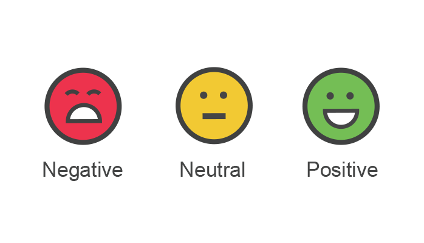

# Twitter Sentiment Analysis

**Hi all,**

Welcome to the project on **Twitter Sentiment Analysis: Practice Problem**. This is an extensive Project on sentiment analysis where our task will be to classify a set of tweets into two categories:

The prerequisites for this Project are basic knowledge of both Machine Learning and Python.

**What is Sentiment Analysis?**
Sentiment analysis (also known as opinion mining) is one of the many applications of Natural Language Processing. It is a set of methods and techniques used for extracting subjective information from text or speech, such as opinions or attitudes. In simple terms, it involves classifying a piece of text as positive, negative or neutral.

**Objective of the Project**
The Project is designed to give you a hands-on experience in solving a sentiment analysis problem using Python. This Project will introduce you to the skills and techniques required to solve text classification/sentiment analysis problems. You will be provided with a sufficient theory and practice material.
**Expectations from the Project**
The Project is divided into below modules:

1. Text Preprocessing
2. Data Exploration
3. Feature Extraction
4. Model Building

These sections are supplemented with theory, coding examples, and exercises. Additionally, you will be provided with below resources:

review test
--date="2024-08-20T07:09:58-08:00"